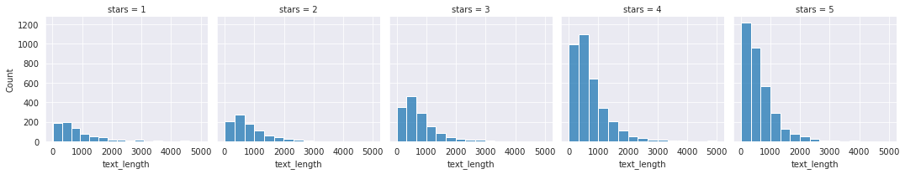
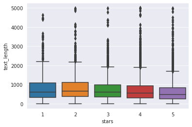
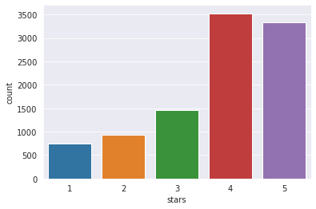
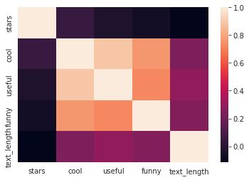

# Natural Language Processing

Natural Langugage Processing is a subset of machine learning which involves processing text and building a classifier. It is a vast domain, with various algorithms and techniques, and multiple approaches to a given problem.
In this project, we attempt to classify yelp reviews into 1 star or 5 star reviews based off the text context in the reviews.

## Imports


```python
import numpy as np
import pandas as pd
import matplotlib as pyplot
import seaborn as sns
%matplotlib inline
```


```python
yelp = pd.read_csv('yelp.csv')
yelp.head()
```


<div>
<style scoped>
    .dataframe tbody tr th:only-of-type {
        vertical-align: middle;
    }

    .dataframe tbody tr th {
        vertical-align: top;
    }

    .dataframe thead th {
        text-align: right;
    }
</style>
<table border="1" class="dataframe">
  <thead>
    <tr style="text-align: right;">
      <th></th>
      <th>business_id</th>
      <th>date</th>
      <th>review_id</th>
      <th>stars</th>
      <th>text</th>
      <th>type</th>
      <th>user_id</th>
      <th>cool</th>
      <th>useful</th>
      <th>funny</th>
    </tr>
  </thead>
  <tbody>
    <tr>
      <th>0</th>
      <td>9yKzy9PApeiPPOUJEtnvkg</td>
      <td>2011-01-26</td>
      <td>fWKvX83p0-ka4JS3dc6E5A</td>
      <td>5</td>
      <td>My wife took me here on my birthday for breakf...</td>
      <td>review</td>
      <td>rLtl8ZkDX5vH5nAx9C3q5Q</td>
      <td>2</td>
      <td>5</td>
      <td>0</td>
    </tr>
    <tr>
      <th>1</th>
      <td>ZRJwVLyzEJq1VAihDhYiow</td>
      <td>2011-07-27</td>
      <td>IjZ33sJrzXqU-0X6U8NwyA</td>
      <td>5</td>
      <td>I have no idea why some people give bad review...</td>
      <td>review</td>
      <td>0a2KyEL0d3Yb1V6aivbIuQ</td>
      <td>0</td>
      <td>0</td>
      <td>0</td>
    </tr>
    <tr>
      <th>2</th>
      <td>6oRAC4uyJCsJl1X0WZpVSA</td>
      <td>2012-06-14</td>
      <td>IESLBzqUCLdSzSqm0eCSxQ</td>
      <td>4</td>
      <td>love the gyro plate. Rice is so good and I als...</td>
      <td>review</td>
      <td>0hT2KtfLiobPvh6cDC8JQg</td>
      <td>0</td>
      <td>1</td>
      <td>0</td>
    </tr>
    <tr>
      <th>3</th>
      <td>_1QQZuf4zZOyFCvXc0o6Vg</td>
      <td>2010-05-27</td>
      <td>G-WvGaISbqqaMHlNnByodA</td>
      <td>5</td>
      <td>Rosie, Dakota, and I LOVE Chaparral Dog Park!!...</td>
      <td>review</td>
      <td>uZetl9T0NcROGOyFfughhg</td>
      <td>1</td>
      <td>2</td>
      <td>0</td>
    </tr>
    <tr>
      <th>4</th>
      <td>6ozycU1RpktNG2-1BroVtw</td>
      <td>2012-01-05</td>
      <td>1uJFq2r5QfJG_6ExMRCaGw</td>
      <td>5</td>
      <td>General Manager Scott Petello is a good egg!!!...</td>
      <td>review</td>
      <td>vYmM4KTsC8ZfQBg-j5MWkw</td>
      <td>0</td>
      <td>0</td>
      <td>0</td>
    </tr>
  </tbody>
</table>
</div>


```python
yelp.info()
```

    <class 'pandas.core.frame.DataFrame'>
    RangeIndex: 10000 entries, 0 to 9999
    Data columns (total 10 columns):
     #   Column       Non-Null Count  Dtype 
    ---  ------       --------------  ----- 
     0   business_id  10000 non-null  object
     1   date         10000 non-null  object
     2   review_id    10000 non-null  object
     3   stars        10000 non-null  int64 
     4   text         10000 non-null  object
     5   type         10000 non-null  object
     6   user_id      10000 non-null  object
     7   cool         10000 non-null  int64 
     8   useful       10000 non-null  int64 
     9   funny        10000 non-null  int64 
    dtypes: int64(4), object(6)
    memory usage: 781.4+ KB


```python
yelp.describe()
```


<div>
<style scoped>
    .dataframe tbody tr th:only-of-type {
        vertical-align: middle;
    }

    .dataframe tbody tr th {
        vertical-align: top;
    }

    .dataframe thead th {
        text-align: right;
    }
</style>
<table border="1" class="dataframe">
  <thead>
    <tr style="text-align: right;">
      <th></th>
      <th>stars</th>
      <th>cool</th>
      <th>useful</th>
      <th>funny</th>
    </tr>
  </thead>
  <tbody>
    <tr>
      <th>count</th>
      <td>10000.000000</td>
      <td>10000.000000</td>
      <td>10000.000000</td>
      <td>10000.000000</td>
    </tr>
    <tr>
      <th>mean</th>
      <td>3.777500</td>
      <td>0.876800</td>
      <td>1.409300</td>
      <td>0.701300</td>
    </tr>
    <tr>
      <th>std</th>
      <td>1.214636</td>
      <td>2.067861</td>
      <td>2.336647</td>
      <td>1.907942</td>
    </tr>
    <tr>
      <th>min</th>
      <td>1.000000</td>
      <td>0.000000</td>
      <td>0.000000</td>
      <td>0.000000</td>
    </tr>
    <tr>
      <th>25%</th>
      <td>3.000000</td>
      <td>0.000000</td>
      <td>0.000000</td>
      <td>0.000000</td>
    </tr>
    <tr>
      <th>50%</th>
      <td>4.000000</td>
      <td>0.000000</td>
      <td>1.000000</td>
      <td>0.000000</td>
    </tr>
    <tr>
      <th>75%</th>
      <td>5.000000</td>
      <td>1.000000</td>
      <td>2.000000</td>
      <td>1.000000</td>
    </tr>
    <tr>
      <th>max</th>
      <td>5.000000</td>
      <td>77.000000</td>
      <td>76.000000</td>
      <td>57.000000</td>
    </tr>
  </tbody>
</table>
</div>


## Sample Reviews


```python
# cool review
print(yelp[yelp["cool"] == yelp["cool"].max()]["text"].iloc[0])
```

    Love this place! Amazing Happy Hour Specials!!


```python
# useful review
print(yelp[yelp["useful"] == yelp["useful"].max()]["text"].iloc[0])
```

    Love this place! Amazing Happy Hour Specials!!


```python
# funny review
print(yelp[yelp["funny"] == yelp["funny"].max()]["text"].iloc[0])
```

    Scary things to me:
    Paris Hilton has a career. 
    Sarah Palin. Really. She's like the new Anita Bryant. 
    My fathers' overgrown eyebrows. Trim, daddy, trim!
    Droves of high schoolers leaving school just as I'm trying to find Barrio Cafe. 
    
    Seriously. Like thousands of them. And I couldn't find the damn restaurant. What was I gonna do? Roll down the window (well, not roll down, seriously, who rolls down windows anymore?) and holler out in my best lispy voice, "Hey, squeeze me fellas, I'm going to a wine tasting at the Barrio Cafe. Y'all know where that is?" Since all teenagers carry guns, yes, that scared me. 
    
    Finally. I found it. And entered. 
    
    Cute. Cozy. Middle of the day, so empty. Great, vibrant art. And a very attentive and friendly staff. Often times at this time of day, restaurants really drop the ball. No ball dropping here.
    I had La Paloma margarita which is made with a grapefruit soda. Think Squirt and Patron! And after a couple of these babies I was in el bano squirting out that Patron. Dee lish however. 
    
    I ordered the Enchiladas Del Mar. Enchiladas of the Sea for my non Spanish speaking peeps. You know what? It was good. Not great. And the presentation was somewhat messy. I couldn't find the crab or the scallops (which were the size of the ends of q-tips by the way). They were lost in the sauce and the cheese. But I devoured it as the blue corn tortillas sang to me. My friend had a chickent torta. Big and rustic. Like Janet Reno. She loved it! 
    
    I will most definitely be back. Hopefully I will not have to navigate through the plethora of pubescent people and hopefullyl I will pick that Barrio menu item that will blow my calcentinas off. 
    
    Oh. That's blow my socks off. BTW. Adios for now mi yelpitas!


```python
yelp["text_length"] = yelp["text"].apply(len)
yelp.head()
```


<div>
<style scoped>
    .dataframe tbody tr th:only-of-type {
        vertical-align: middle;
    }

    .dataframe tbody tr th {
        vertical-align: top;
    }

    .dataframe thead th {
        text-align: right;
    }
</style>
<table border="1" class="dataframe">
  <thead>
    <tr style="text-align: right;">
      <th></th>
      <th>business_id</th>
      <th>date</th>
      <th>review_id</th>
      <th>stars</th>
      <th>text</th>
      <th>type</th>
      <th>user_id</th>
      <th>cool</th>
      <th>useful</th>
      <th>funny</th>
      <th>text_length</th>
    </tr>
  </thead>
  <tbody>
    <tr>
      <th>0</th>
      <td>9yKzy9PApeiPPOUJEtnvkg</td>
      <td>2011-01-26</td>
      <td>fWKvX83p0-ka4JS3dc6E5A</td>
      <td>5</td>
      <td>My wife took me here on my birthday for breakf...</td>
      <td>review</td>
      <td>rLtl8ZkDX5vH5nAx9C3q5Q</td>
      <td>2</td>
      <td>5</td>
      <td>0</td>
      <td>889</td>
    </tr>
    <tr>
      <th>1</th>
      <td>ZRJwVLyzEJq1VAihDhYiow</td>
      <td>2011-07-27</td>
      <td>IjZ33sJrzXqU-0X6U8NwyA</td>
      <td>5</td>
      <td>I have no idea why some people give bad review...</td>
      <td>review</td>
      <td>0a2KyEL0d3Yb1V6aivbIuQ</td>
      <td>0</td>
      <td>0</td>
      <td>0</td>
      <td>1345</td>
    </tr>
    <tr>
      <th>2</th>
      <td>6oRAC4uyJCsJl1X0WZpVSA</td>
      <td>2012-06-14</td>
      <td>IESLBzqUCLdSzSqm0eCSxQ</td>
      <td>4</td>
      <td>love the gyro plate. Rice is so good and I als...</td>
      <td>review</td>
      <td>0hT2KtfLiobPvh6cDC8JQg</td>
      <td>0</td>
      <td>1</td>
      <td>0</td>
      <td>76</td>
    </tr>
    <tr>
      <th>3</th>
      <td>_1QQZuf4zZOyFCvXc0o6Vg</td>
      <td>2010-05-27</td>
      <td>G-WvGaISbqqaMHlNnByodA</td>
      <td>5</td>
      <td>Rosie, Dakota, and I LOVE Chaparral Dog Park!!...</td>
      <td>review</td>
      <td>uZetl9T0NcROGOyFfughhg</td>
      <td>1</td>
      <td>2</td>
      <td>0</td>
      <td>419</td>
    </tr>
    <tr>
      <th>4</th>
      <td>6ozycU1RpktNG2-1BroVtw</td>
      <td>2012-01-05</td>
      <td>1uJFq2r5QfJG_6ExMRCaGw</td>
      <td>5</td>
      <td>General Manager Scott Petello is a good egg!!!...</td>
      <td>review</td>
      <td>vYmM4KTsC8ZfQBg-j5MWkw</td>
      <td>0</td>
      <td>0</td>
      <td>0</td>
      <td>469</td>
    </tr>
  </tbody>
</table>
</div>


## Data Visualistion


```python
sns.set_style("darkgrid")
g = sns.FacetGrid(yelp,col="stars")
g.map(sns.histplot,"text_length",bins=15)
```


    <seaborn.axisgrid.FacetGrid at 0x7f4fbd336640>


    

    


```python
sns.boxplot(data=yelp,x="stars",y="text_length")
```


    <AxesSubplot:xlabel='stars', ylabel='text_length'>


    

    


```python
sns.countplot(data=yelp,x="stars")
```


    <AxesSubplot:xlabel='stars', ylabel='count'>


    

    


```python
group_by = yelp.groupby(["stars"]).mean()
```


```python
group_by
```


<div>
<style scoped>
    .dataframe tbody tr th:only-of-type {
        vertical-align: middle;
    }

    .dataframe tbody tr th {
        vertical-align: top;
    }

    .dataframe thead th {
        text-align: right;
    }
</style>
<table border="1" class="dataframe">
  <thead>
    <tr style="text-align: right;">
      <th></th>
      <th>cool</th>
      <th>useful</th>
      <th>funny</th>
      <th>text_length</th>
    </tr>
    <tr>
      <th>stars</th>
      <th></th>
      <th></th>
      <th></th>
      <th></th>
    </tr>
  </thead>
  <tbody>
    <tr>
      <th>1</th>
      <td>0.576769</td>
      <td>1.604806</td>
      <td>1.056075</td>
      <td>826.515354</td>
    </tr>
    <tr>
      <th>2</th>
      <td>0.719525</td>
      <td>1.563107</td>
      <td>0.875944</td>
      <td>842.256742</td>
    </tr>
    <tr>
      <th>3</th>
      <td>0.788501</td>
      <td>1.306639</td>
      <td>0.694730</td>
      <td>758.498289</td>
    </tr>
    <tr>
      <th>4</th>
      <td>0.954623</td>
      <td>1.395916</td>
      <td>0.670448</td>
      <td>712.923142</td>
    </tr>
    <tr>
      <th>5</th>
      <td>0.944261</td>
      <td>1.381780</td>
      <td>0.608631</td>
      <td>624.999101</td>
    </tr>
  </tbody>
</table>
</div>


```python
group_by_corr = yelp.corr()
```


```python
group_by_corr
```


<div>
<style scoped>
    .dataframe tbody tr th:only-of-type {
        vertical-align: middle;
    }

    .dataframe tbody tr th {
        vertical-align: top;
    }

    .dataframe thead th {
        text-align: right;
    }
</style>
<table border="1" class="dataframe">
  <thead>
    <tr style="text-align: right;">
      <th></th>
      <th>stars</th>
      <th>cool</th>
      <th>useful</th>
      <th>funny</th>
      <th>text_length</th>
    </tr>
  </thead>
  <tbody>
    <tr>
      <th>stars</th>
      <td>1.000000</td>
      <td>0.052555</td>
      <td>-0.023479</td>
      <td>-0.061306</td>
      <td>-0.114674</td>
    </tr>
    <tr>
      <th>cool</th>
      <td>0.052555</td>
      <td>1.000000</td>
      <td>0.887102</td>
      <td>0.764342</td>
      <td>0.241451</td>
    </tr>
    <tr>
      <th>useful</th>
      <td>-0.023479</td>
      <td>0.887102</td>
      <td>1.000000</td>
      <td>0.723406</td>
      <td>0.293975</td>
    </tr>
    <tr>
      <th>funny</th>
      <td>-0.061306</td>
      <td>0.764342</td>
      <td>0.723406</td>
      <td>1.000000</td>
      <td>0.251760</td>
    </tr>
    <tr>
      <th>text_length</th>
      <td>-0.114674</td>
      <td>0.241451</td>
      <td>0.293975</td>
      <td>0.251760</td>
      <td>1.000000</td>
    </tr>
  </tbody>
</table>
</div>


```python
sns.heatmap(group_by_corr)
```


    <AxesSubplot:>


    

    


Let us filter out the 2,3,4 star reviews since our model is for classifying 1 or 5 stars.


```python
yelp_class = yelp[(yelp["stars"]==1)|(yelp["stars"]==5)]
```


```python
yelp_class.head()
```


<div>
<style scoped>
    .dataframe tbody tr th:only-of-type {
        vertical-align: middle;
    }

    .dataframe tbody tr th {
        vertical-align: top;
    }

    .dataframe thead th {
        text-align: right;
    }
</style>
<table border="1" class="dataframe">
  <thead>
    <tr style="text-align: right;">
      <th></th>
      <th>business_id</th>
      <th>date</th>
      <th>review_id</th>
      <th>stars</th>
      <th>text</th>
      <th>type</th>
      <th>user_id</th>
      <th>cool</th>
      <th>useful</th>
      <th>funny</th>
      <th>text_length</th>
    </tr>
  </thead>
  <tbody>
    <tr>
      <th>0</th>
      <td>9yKzy9PApeiPPOUJEtnvkg</td>
      <td>2011-01-26</td>
      <td>fWKvX83p0-ka4JS3dc6E5A</td>
      <td>5</td>
      <td>My wife took me here on my birthday for breakf...</td>
      <td>review</td>
      <td>rLtl8ZkDX5vH5nAx9C3q5Q</td>
      <td>2</td>
      <td>5</td>
      <td>0</td>
      <td>889</td>
    </tr>
    <tr>
      <th>1</th>
      <td>ZRJwVLyzEJq1VAihDhYiow</td>
      <td>2011-07-27</td>
      <td>IjZ33sJrzXqU-0X6U8NwyA</td>
      <td>5</td>
      <td>I have no idea why some people give bad review...</td>
      <td>review</td>
      <td>0a2KyEL0d3Yb1V6aivbIuQ</td>
      <td>0</td>
      <td>0</td>
      <td>0</td>
      <td>1345</td>
    </tr>
    <tr>
      <th>3</th>
      <td>_1QQZuf4zZOyFCvXc0o6Vg</td>
      <td>2010-05-27</td>
      <td>G-WvGaISbqqaMHlNnByodA</td>
      <td>5</td>
      <td>Rosie, Dakota, and I LOVE Chaparral Dog Park!!...</td>
      <td>review</td>
      <td>uZetl9T0NcROGOyFfughhg</td>
      <td>1</td>
      <td>2</td>
      <td>0</td>
      <td>419</td>
    </tr>
    <tr>
      <th>4</th>
      <td>6ozycU1RpktNG2-1BroVtw</td>
      <td>2012-01-05</td>
      <td>1uJFq2r5QfJG_6ExMRCaGw</td>
      <td>5</td>
      <td>General Manager Scott Petello is a good egg!!!...</td>
      <td>review</td>
      <td>vYmM4KTsC8ZfQBg-j5MWkw</td>
      <td>0</td>
      <td>0</td>
      <td>0</td>
      <td>469</td>
    </tr>
    <tr>
      <th>6</th>
      <td>zp713qNhx8d9KCJJnrw1xA</td>
      <td>2010-02-12</td>
      <td>riFQ3vxNpP4rWLk_CSri2A</td>
      <td>5</td>
      <td>Drop what you're doing and drive here. After I...</td>
      <td>review</td>
      <td>wFweIWhv2fREZV_dYkz_1g</td>
      <td>7</td>
      <td>7</td>
      <td>4</td>
      <td>1565</td>
    </tr>
  </tbody>
</table>
</div>


```python
yelp_class.info()
```

    <class 'pandas.core.frame.DataFrame'>
    Int64Index: 4086 entries, 0 to 9999
    Data columns (total 11 columns):
     #   Column       Non-Null Count  Dtype 
    ---  ------       --------------  ----- 
     0   business_id  4086 non-null   object
     1   date         4086 non-null   object
     2   review_id    4086 non-null   object
     3   stars        4086 non-null   int64 
     4   text         4086 non-null   object
     5   type         4086 non-null   object
     6   user_id      4086 non-null   object
     7   cool         4086 non-null   int64 
     8   useful       4086 non-null   int64 
     9   funny        4086 non-null   int64 
     10  text_length  4086 non-null   int64 
    dtypes: int64(5), object(6)
    memory usage: 383.1+ KB


Now we will split the data into x and y


```python
X = yelp_class["text"]
y = yelp_class["stars"]
```

We use the CountVectorizer to vectorize each review into a bag of words. For example:
"Red bag"    (red, blue, bag) = (1, 0, 1)
"Blue bag"   (red, blue, bag) = (0, 1, 1)


```python
from sklearn.feature_extraction.text import CountVectorizer
```


```python
cv = CountVectorizer()
```


```python
X = cv.fit_transform(X)
```


```python
from sklearn.model_selection import train_test_split
X_train, X_test, y_train, y_test = train_test_split(X, y, test_size=0.3, random_state=101)
```

## Using the Naive Bayes Model


```python
from sklearn.naive_bayes import MultinomialNB
```


```python
nb = MultinomialNB()
```


```python
nb.fit(X_train, y_train)
```


    MultinomialNB()


```python
pred = nb.predict(X_test)
```


```python
from sklearn.metrics import classification_report, confusion_matrix
```


```python
print(classification_report(pred, y_test))
```

                  precision    recall  f1-score   support
    
               1       0.70      0.88      0.78       181
               5       0.98      0.93      0.96      1045
    
        accuracy                           0.93      1226
       macro avg       0.84      0.91      0.87      1226
    weighted avg       0.94      0.93      0.93      1226
    


```python
print(confusion_matrix(pred, y_test))
```

    [[159  22]
     [ 69 976]]


## Using Term Frequency-Inverse Term Frequency Transformer

Term Frequency = (No of occurences of word in sentence)/(Total no of words)<br>
Inverse Term Frequency = (No of occurences of word one or more times in all documents)/(Total no of documents)


```python
from sklearn.feature_extraction.text import TfidfTransformer
from sklearn.pipeline import Pipeline
```


```python
Xtext = yelp_class["text"]
y = yelp_class["stars"]
Xtrain, Xtest, ytrain, ytest = train_test_split(Xtext,y)
```

## Using a pipeline
sklearn supports using of a pipeline when multiple stages are involved in the creation of the model. Since we are using the TfIdf trasnformer, our pipeline needs to have 3 stages.
<ol>
    <li>Bag of Words : CountVectorizer()</li>
    <li>Term-Frequency Inverse Term-Frequency : TfidfTransformer()</li>
    <li>Naive Bayes Algorithm : MultinomialNB()</li>
</ol>


```python
pipeline = Pipeline([
    ('bow', CountVectorizer()),
    ('tfidf', TfidfTransformer()),
    ('NaiveBayes', MultinomialNB())
])
```


```python
pipeline.fit(Xtrain,ytrain)
```


    Pipeline(steps=[('bow', CountVectorizer()), ('tfidf', TfidfTransformer()),
                    ('NaiveBayes', MultinomialNB())])


```python
predictions = pipeline.predict(Xtest)
```


```python
print(classification_report(ytest, predictions))
```

                  precision    recall  f1-score   support
    
               1       0.00      0.00      0.00       181
               5       0.82      1.00      0.90       841
    
        accuracy                           0.82      1022
       macro avg       0.41      0.50      0.45      1022
    weighted avg       0.68      0.82      0.74      1022
    


    /home/bogeymantan/anaconda3/lib/python3.9/site-packages/sklearn/metrics/_classification.py:1318: UndefinedMetricWarning: Precision and F-score are ill-defined and being set to 0.0 in labels with no predicted samples. Use `zero_division` parameter to control this behavior.
      _warn_prf(average, modifier, msg_start, len(result))
    /home/bogeymantan/anaconda3/lib/python3.9/site-packages/sklearn/metrics/_classification.py:1318: UndefinedMetricWarning: Precision and F-score are ill-defined and being set to 0.0 in labels with no predicted samples. Use `zero_division` parameter to control this behavior.
      _warn_prf(average, modifier, msg_start, len(result))
    /home/bogeymantan/anaconda3/lib/python3.9/site-packages/sklearn/metrics/_classification.py:1318: UndefinedMetricWarning: Precision and F-score are ill-defined and being set to 0.0 in labels with no predicted samples. Use `zero_division` parameter to control this behavior.
      _warn_prf(average, modifier, msg_start, len(result))


Sometimes, using a TfIdf Classifier makes things worse. Clearly, this is the case. Let us create a final pipeline without the tf-idf.


```python
pipeline = Pipeline([
    ('bow', CountVectorizer()),
    ('NaiveBayes', MultinomialNB())
])
pipeline.fit(Xtrain,ytrain)
predictions = pipeline.predict(Xtest)
print(classification_report(ytest, predictions))
print(confusion_matrix(ytest, predictions))
```

                  precision    recall  f1-score   support
    
               1       0.86      0.64      0.73       181
               5       0.93      0.98      0.95       841
    
        accuracy                           0.92      1022
       macro avg       0.89      0.81      0.84      1022
    weighted avg       0.91      0.92      0.91      1022
    
    [[116  65]
     [ 19 822]]

